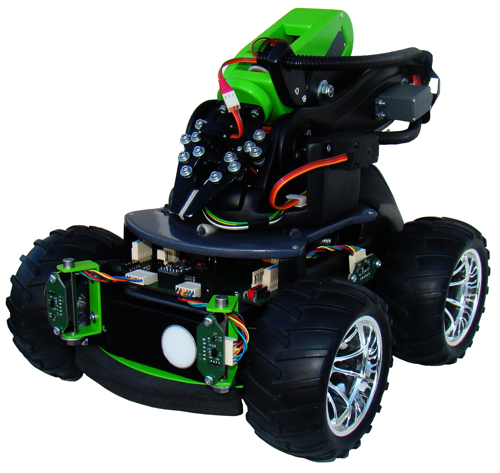

# ROBOT CLAIRE
This project is the result of three years of development from my high school
years. The main goal was to build my own robot from scratch, without using
common construction parts that are readily available in many hobbyist shops
today.

At the time when I was creating my robot, open-source CAD programs weren’t at a
sufficient level to design something that could be sent to a factory for
fabrication. For this reason, the mechanical design was created using Inventor
2013, while the electronic design was done using KiCad. The project has already
gone through three upgrades, but the first one wasn’t documented. However, I
did take some photos to capture the atmosphere of the very first steps in
development ([claire-rev0](https://drive.google.com/open?id=1PmOoYiifd_Xv0sS2DL9yxbEeKM7cLnv_)).

## NAVIGATION IN PROJECT
In the following folders, you will find README.md files with more detailed
descriptions of the content. Some folders also include additional information,
such as installation and execution instructions, particularly in directories
containing software. Please note that this repository is still under
development, and not all folders have been fully uploaded yet.

